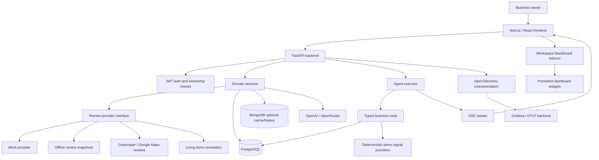
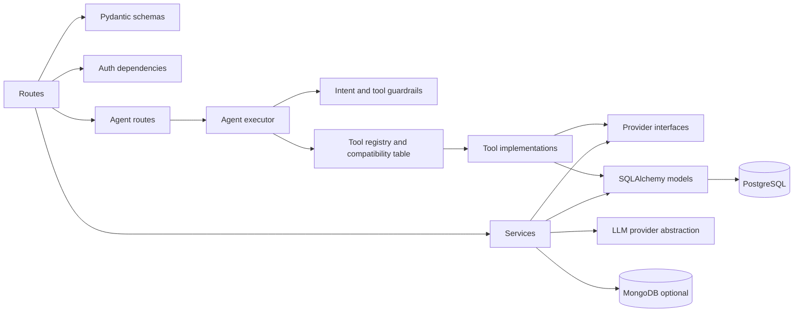
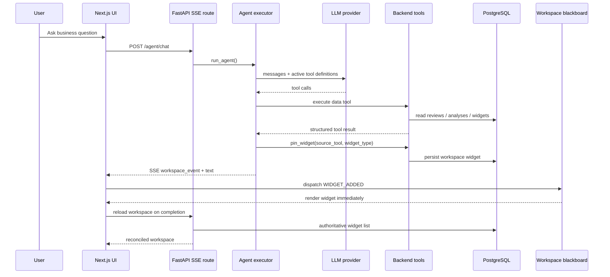
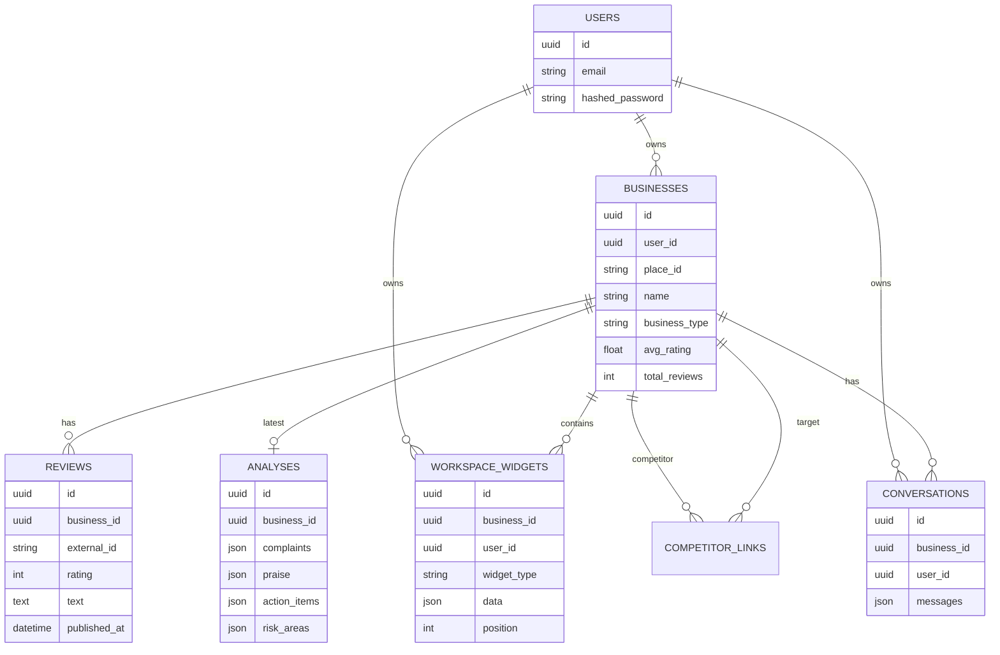
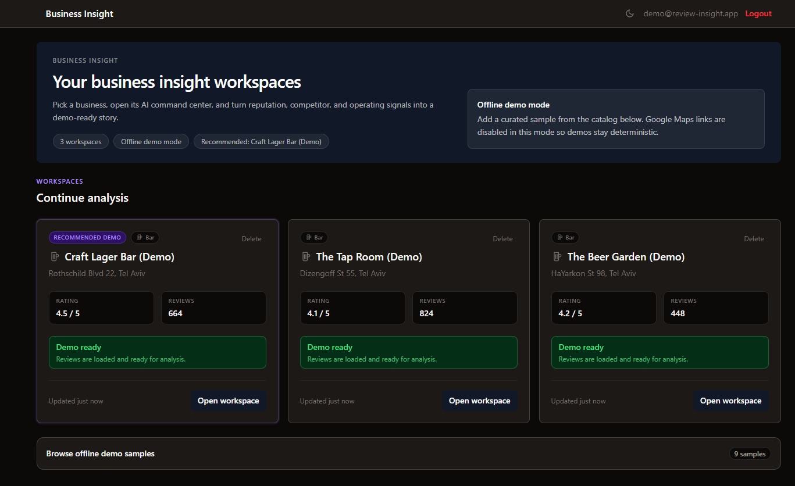
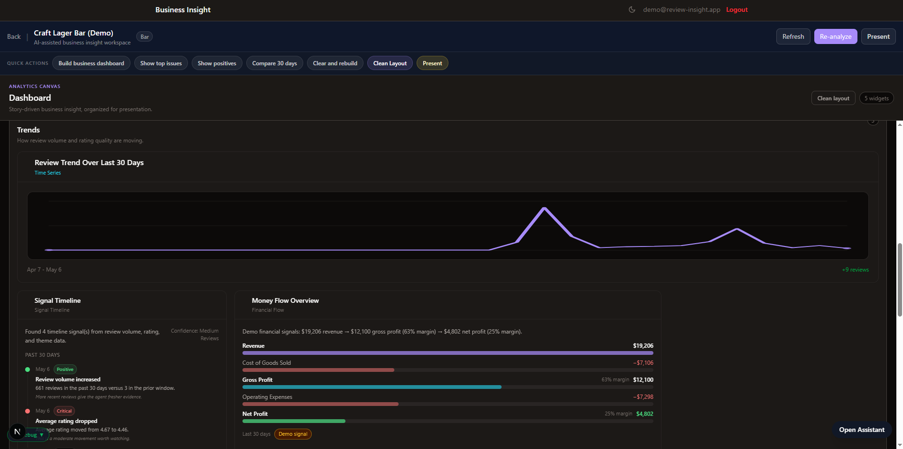
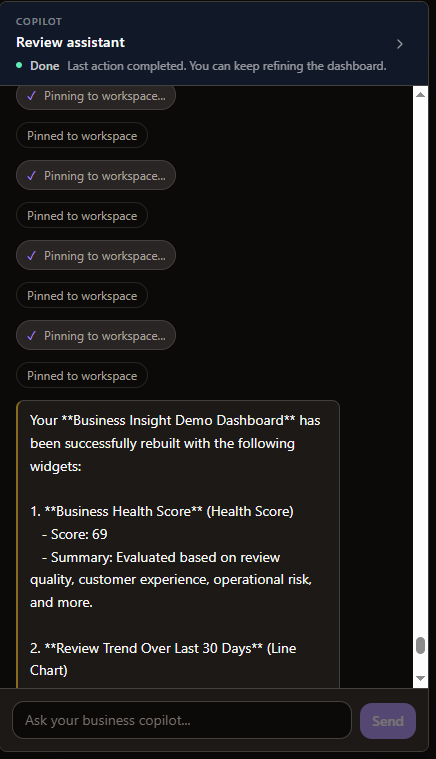
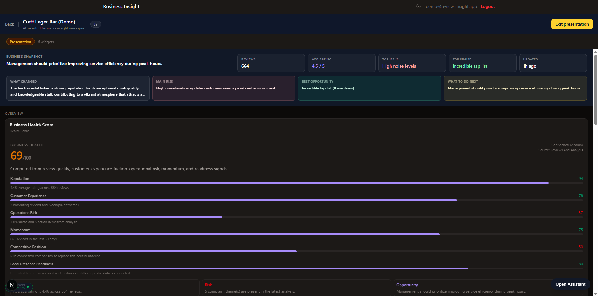
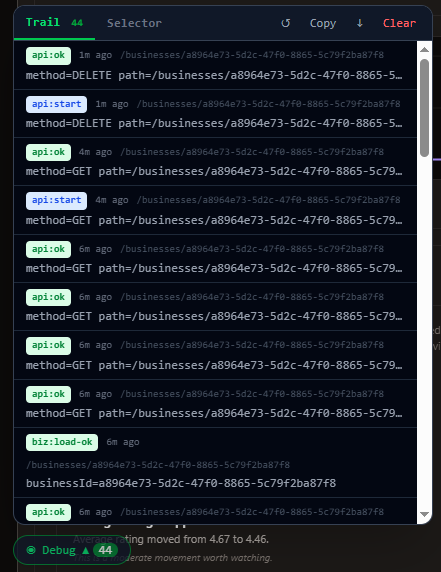

# Business Insight

Business Insight is an AI business copilot for local SMBs. It starts with Google Maps reviews, then combines reputation, competitor context, and deterministic demo business signals into a live dashboard that explains what is happening, why it matters, and what to do next.

The project began as a review analysis tool and was deliberately expanded into a broader business workspace: an owner can import a business, fetch or load reviews, run AI analysis, compare competitors, ask a natural-language agent for help, and persist useful answers as dashboard widgets.

The important engineering idea is simple: the agent is not a loose chat box. It is a tool-driven system with typed backend tools, widget compatibility checks, feature flags, deterministic test providers, persisted workspace state, and production deployment/observability paths.

## Table of Contents

- [What It Does](#what-it-does)
- [Why It Exists](#why-it-exists)
- [Demo Status](#demo-status)
- [Product Walkthrough](#product-walkthrough)
- [Architecture](#architecture)
- [Agent Design](#agent-design)
- [Business Insight Modules](#business-insight-modules)
- [Data Sources](#data-sources)
- [Quality Bar](#quality-bar)
- [Quick Start](#quick-start)
- [Configuration](#configuration)
- [API Surface](#api-surface)
- [Testing](#testing)
- [Project Structure](#project-structure)
- [Deployment and Operations](#deployment-and-operations)
- [Screenshots](#screenshots)
- [Roadmap](#roadmap)
- [License](#license)

## What It Does

Business Insight gives a local business owner a single workspace for customer voice and business diagnostics:

- Import or create businesses from Google Maps / offline sample data.
- Fetch and store reviews through a pluggable provider layer.
- Generate structured AI analysis: complaints, praise, action items, risks, recommended focus.
- Compare the business against linked competitors.
- Ask an AI copilot natural-language questions about reviews, trends, issues, opportunities, and next actions.
- Pin the agent's useful outputs as persistent dashboard widgets.
- Build a dashboard with health score, signal timeline, review trends, top issues, evidence, opportunities, action plan, demo sales, operations, local presence, social signal, and money-flow widgets.
- Run deterministic local/CI tests without live LLM calls.

## Why It Exists

Small business owners can receive hundreds of reviews but rarely have time to read them, compare competitors, spot operational patterns, and decide what to do next.

Most dashboards show charts. Business Insight tries to do more:

- **Explain** what changed, not just show that a metric moved.
- **Connect evidence** from reviews, competitors, and business signals.
- **Recommend action** with owner, effort, impact, and metric-to-watch fields.
- **Preserve context** by letting the agent build and update a durable workspace.
- **Disclose uncertainty** when data is sparse or demo-only.

## Demo Status

The repo is in the middle of the public transition from **Review Insight Tool** to **Business Insight**.

Implemented in the current working tree:

| Phase   | Status    | What changed                                                                                                                                      |
| ------- | --------- | ------------------------------------------------------------------------------------------------------------------------------------------------- |
| Phase 1 | Done      | Public rebrand to Business Insight in app copy, docs, README direction, and agent framing. Internal DB names/routes stay unchanged for stability. |
| Phase 2 | Done      | Computed-on-demand `get_business_health` tool and `health_score` widget.                                                                          |
| Phase 3 | Done      | `get_signal_timeline` tool and `signal_timeline` widget for "what changed" stories.                                                               |
| Phase 4 | Done      | Deterministic demo signals for sales, operations, local presence, and social signal widgets.                                                      |
| Phase 5 | Done      | Evidence-backed `get_opportunities` and `get_action_plan` tools/widgets.                                                                          |
| Phase 6 | Not built | Real integrations such as Google Business Profile, POS, or social APIs are intentionally deferred until the demo signal contracts prove useful.   |

Outstanding before treating this as fully shipped:

- Commit and push the Phase 1-5 working-tree changes.
- Run the expanded Playwright suite for the new Business Insight tool flows.
- Refresh screenshots after the rebrand.
- Complete any manual deployment checks required by the hosting environment.

This is intentional: the product proves the multi-signal experience first with deterministic/offline providers, then real integrations can replace those providers without changing widget contracts.

## Product Walkthrough

1. **Create or import a business**
   - In normal mode, paste a Google Maps URL or place ID.
   - In offline demo mode, import a bundled sample business from the sandbox catalog.

2. **Fetch reviews**
   - Provider can be `mock`, `offline`, `outscraper`, or `simulation`.
   - Refreshing reviews replaces stale review rows and clears stale analysis.

3. **Run AI analysis**
   - Analysis produces structured fields used by the dashboard and agent: complaints, praise, actions, risks, summary, and recommended focus.

4. **Compare competitors**
   - Link competitor businesses, analyze them, then generate a comparison from stored analysis snapshots.

5. **Use the AI copilot**
   - Ask: "What changed this week?", "Build a dashboard", "What should we do next?", "Show money flow", "What are the top issues?"
   - The agent calls backend tools, streams progress over SSE, and can pin results to the workspace.

6. **Present the dashboard**
   - Widgets persist by business/user.
   - Drag/reorder/remove flows are persisted.
   - Presentation mode turns the workspace into a cleaner demo/readout surface.

## Architecture

### System Overview



### Backend Layers



| Layer         | Responsibility                                                                                     |
| ------------- | -------------------------------------------------------------------------------------------------- |
| Routes        | HTTP boundary, auth enforcement, request/response handling.                                        |
| Services      | Business logic for reviews, analysis, comparison, dashboard aggregation.                           |
| Providers     | Replaceable review sources with one normalized output shape.                                       |
| Agent         | LLM loop, tool execution order, SSE events, pin recovery, workspace mutations.                     |
| Models        | SQLAlchemy entities for users, businesses, reviews, analyses, competitors, conversations, widgets. |
| Schemas       | Pydantic contracts for API and workspace payloads.                                                 |
| Observability | Structured logs, OpenTelemetry, synthetic monitor, debug tooling.                                  |

### Agent and Workspace Flow



### Data Model Snapshot



## Agent Design

The agent is built to be inspectable and testable.

### Tool Registry

Backend tools are declared in one registry and exposed to the LLM as function-calling tools. The same registry also drives widget compatibility.

Representative tools:

| Tool                         | Output / widget                          |
| ---------------------------- | ---------------------------------------- |
| `get_dashboard`              | Business overview and existing analysis. |
| `query_reviews`              | Review evidence list.                    |
| `get_review_series`          | Review trend line chart.                 |
| `get_top_issues`             | Ranked issue chart / issue summary.      |
| `compare_competitors`        | Competitor comparison.                   |
| `get_business_health`        | `health_score` widget.                   |
| `get_signal_timeline`        | `signal_timeline` widget.                |
| `get_sales_summary`          | `sales_summary` widget.                  |
| `get_operations_summary`     | `operations_risk` widget.                |
| `get_local_presence_summary` | `local_presence_card` widget.            |
| `get_social_signal_summary`  | `social_signal` widget.                  |
| `get_financial_flow`         | `money_flow` widget.                     |
| `get_opportunities`          | `opportunity_list` widget.               |
| `get_action_plan`            | `action_plan` widget.                    |

### Safety and Reliability Decisions

- **Source-tool pinning:** `pin_widget` references the exact tool result that should become a widget.
- **Compatibility table:** unsupported tool/widget pairs are rejected instead of rendering empty cards.
- **Money-flow protection:** profit-bridge-shaped custom charts are redirected to the dedicated `money_flow` path.
- **Cross-turn recovery:** recent successful tool results are rehydrated so a later "yes, use that" turn can still pin the correct data.
- **Feature-flagged tool exposure:** `BUSINESS_INSIGHT_ENABLED`, `DEMO_SIGNALS_ENABLED`, and `SIGNAL_PROVIDER` control which tools the model can see.
- **Demo signal disclosure:** synthetic signals return `is_demo`, `source`, `freshness`, `confidence`, and `limitations`.
- **Deterministic E2E:** scripted LLM fixtures drive the real SSE/tool/workspace path without live model variance.

## Business Insight Modules

Business Insight is organized around product modules, not just charts.

| Module              | What it answers                                            | Current implementation                                                             |
| ------------------- | ---------------------------------------------------------- | ---------------------------------------------------------------------------------- |
| Reputation          | Are customers happy? What changed in rating/review volume? | Review ingestion, rating distribution, trends, review series.                      |
| Customer Experience | What do people praise or complain about?                   | AI analysis, top issues, review insights, representative evidence.                 |
| Competitors         | How do we compare?                                         | Competitor links, analysis snapshots, comparison generation, optional Mongo cache. |
| Business Health     | How is the business doing overall?                         | Computed health score with sub-scores, drivers, risks, opportunities, limitations. |
| Signal Timeline     | What happened recently?                                    | Review-volume/rating/theme event timeline.                                         |
| Demo Demand         | Did demand/sales move?                                     | Deterministic `sales_summary` demo provider.                                       |
| Operations          | Is service under pressure?                                 | Deterministic `operations_risk` demo provider plus review evidence.                |
| Local Presence      | Is the business discoverable and ready?                    | Deterministic `local_presence_card` demo provider.                                 |
| Social Signal       | Is there external buzz?                                    | Deterministic `social_signal` demo provider.                                       |
| Growth Actions      | What should we do next?                                    | Opportunity finder and action-plan tools.                                          |
| Money Flow          | Where does revenue go?                                     | Dedicated financial-flow/profit-bridge widget path.                                |

## Data Sources

### Review Providers

All review providers implement the same interface and return normalized reviews. The rest of the app does not care which provider produced the data.

| Provider     | `REVIEW_PROVIDER` | Use case                                     | External keys                                         |
| ------------ | ----------------- | -------------------------------------------- | ----------------------------------------------------- |
| `mock`       | default           | Fast local dev and tests.                    | None                                                  |
| `offline`    | demo mode         | Bundled realistic review snapshots.          | None for reviews; optional LLM key for live analysis. |
| `outscraper` | live reviews      | Google Maps review fetch through Outscraper. | `OUTSCRAPER_API_KEY`                                  |
| `simulation` | living demo world | Reads generated demo reviews from Postgres.  | None for reviews.                                     |

### Demo Signal Providers

The broader Business Insight modules currently use deterministic demo/offline providers. This is a deliberate architecture choice:

- Demo signals are predictable enough for tests and demos.
- Widgets and tool contracts are stable before OAuth/API work begins.
- Real integrations can replace demo providers later without changing saved widget types.
- The agent is required to disclose demo/offline provenance.

## Quality Bar

This project is intentionally structured to show engineering discipline, not just a working demo.

| Area                      | What exists                                                                                     |
| ------------------------- | ----------------------------------------------------------------------------------------------- |
| Backend tests             | Unit and integration tests with in-memory SQLite where appropriate.                             |
| Frontend tests            | Vitest component/reducer tests for widgets, dashboard sections, and agent UI behavior.          |
| Browser E2E               | Playwright specs for high-risk agent/dashboard flows using scripted LLM fixtures.               |
| CI                        | Backend lint/tests, frontend lint/build, Playwright job.                                        |
| Deterministic LLM testing | `LLM_PROVIDER=scripted` and `TESTING=true` gate test-only model behavior.                       |
| Migrations                | Alembic manages schema changes; app startup does not create production tables ad hoc.           |
| Auth boundaries           | JWT auth plus per-route ownership checks.                                                       |
| Provider boundaries       | Review providers and signal providers are isolated from routes/UI.                              |
| Observability             | Structured logs, OpenTelemetry hooks, Grafana dashboards, synthetic monitor, debug MCP tooling. |
| Failure handling          | Workspace reload recovery, per-row widget serialization guard, clear user-facing error states.  |

## Quick Start

### Docker Compose

Requires Docker.

```bash
git clone https://github.com/YuriShkurko/review-insight-tool.git
cd review-insight-tool
cp backend/.env.example backend/.env
make up
make db-upgrade
```

Open:

- Frontend: http://localhost:3000
- Backend docs: http://localhost:8000/docs

Default `REVIEW_PROVIDER=mock` works without API keys.

### Offline Demo Mode

Offline mode uses bundled review snapshots and the sandbox catalog.

```bash
# In backend/.env
REVIEW_PROVIDER=offline
OPENAI_API_KEY=your-key   # optional; without it, sample analysis paths are used

make up
make db-upgrade
make seed-offline
```

Then log in as:

```text
demo@example.com / demo1234
```

In offline mode, `POST /api/businesses` is intentionally blocked. Use the sandbox catalog import flow so demos remain repeatable.

### Local Development Without Docker

Requires Python 3.11+, Node.js 18+, and PostgreSQL 16.

```bash
# Terminal 1: database, for example with Docker
docker run --name review-insight-db ^
  -e POSTGRES_PASSWORD=postgres ^
  -e POSTGRES_DB=review_insight ^
  -p 5432:5432 ^
  -d postgres:16
```

```bash
# Terminal 2: backend
cd backend
python -m venv venv
venv\Scripts\activate
pip install -r requirements.txt
cp .env.example .env
alembic upgrade head
python -m uvicorn app.main:app --reload --port 8000
```

```bash
# Terminal 3: frontend
cd frontend
npm install
cp .env.local.example .env.local
npm run dev
```

### LAN / Mobile Testing

```bash
make dev-mobile
```

This binds backend and frontend to `0.0.0.0`. Open `http://<your-LAN-IP>:3000` from a phone on the same Wi-Fi.

## Configuration

### Backend

| Variable                   | Default         | Purpose                                                 |
| -------------------------- | --------------- | ------------------------------------------------------- |
| `DATABASE_URL`             | local Postgres  | SQL database.                                           |
| `REVIEW_PROVIDER`          | `mock`          | `mock`, `offline`, `outscraper`, or `simulation`.       |
| `OPENAI_API_KEY`           | empty           | Analysis and OpenAI agent calls.                        |
| `LLM_PROVIDER`             | `openai`        | `openai`, `openrouter`, or test-only `scripted`.        |
| `LLM_MODEL`                | `gpt-4o-mini`   | Analysis/comparison model.                              |
| `LLM_AGENT_MODEL`          | `gpt-4o-mini`   | Agent model.                                            |
| `OPENROUTER_API_KEY`       | empty           | Used when `LLM_PROVIDER=openrouter`.                    |
| `OUTSCRAPER_API_KEY`       | empty           | Live Google Maps review provider.                       |
| `GOOGLE_PLACES_API_KEY`    | empty           | Optional place lookup.                                  |
| `JWT_SECRET_KEY`           | dev placeholder | JWT signing key.                                        |
| `MONGO_URI`                | empty           | Optional comparison cache/history/raw response storage. |
| `BUSINESS_INSIGHT_ENABLED` | `true`          | Exposes broader Business Insight tools.                 |
| `DEMO_SIGNALS_ENABLED`     | `true`          | Exposes deterministic demo signal tools.                |
| `SIGNAL_PROVIDER`          | `demo`          | Signal provider family.                                 |
| `DEBUG_TRACE`              | `false`         | Enables local trace ring/debug UI support.              |
| `TESTING`                  | `false`         | Gates `/api/test/*` and scripted LLM provider.          |

### Frontend

| Variable                  | Purpose                                            |
| ------------------------- | -------------------------------------------------- |
| `NEXT_PUBLIC_API_URL`     | Backend base URL, usually `http://localhost:8000`. |
| `NEXT_PUBLIC_DEBUG_TRAIL` | Enables the browser debug trail panel when set.    |

## API Surface

All app endpoints are under `/api`.

### Core

| Endpoint                             | Method     | Description                                         |
| ------------------------------------ | ---------- | --------------------------------------------------- |
| `/api/bootstrap`                     | GET        | Public client hints such as active review provider. |
| `/api/auth/register`                 | POST       | Register user.                                      |
| `/api/auth/login`                    | POST       | Login and receive JWT.                              |
| `/api/auth/me`                       | GET        | Current user.                                       |
| `/api/businesses`                    | GET/POST   | List or create businesses.                          |
| `/api/businesses/{id}`               | GET/DELETE | Read or delete a business.                          |
| `/api/businesses/{id}/fetch-reviews` | POST       | Fetch/replace reviews.                              |
| `/api/businesses/{id}/reviews`       | GET        | List stored reviews.                                |
| `/api/businesses/{id}/analyze`       | POST       | Run structured AI analysis.                         |
| `/api/businesses/{id}/dashboard`     | GET        | Aggregated dashboard view.                          |

### Competitors

| Endpoint                                      | Method   | Description               |
| --------------------------------------------- | -------- | ------------------------- |
| `/api/businesses/{id}/competitors`            | GET/POST | List or link competitors. |
| `/api/businesses/{id}/competitors/{cid}`      | DELETE   | Remove competitor link.   |
| `/api/businesses/{id}/competitors/comparison` | POST     | Generate AI comparison.   |

### Agent Workspace

| Endpoint                                         | Method | Description                      |
| ------------------------------------------------ | ------ | -------------------------------- |
| `/api/businesses/{id}/agent/chat`                | POST   | SSE chat stream with tool calls. |
| `/api/businesses/{id}/agent/workspace`           | GET    | List persisted widgets.          |
| `/api/businesses/{id}/agent/workspace`           | POST   | Manually pin widget.             |
| `/api/businesses/{id}/agent/workspace/reorder`   | PATCH  | Persist exact widget order.      |
| `/api/businesses/{id}/agent/workspace/{wid}`     | DELETE | Remove widget.                   |
| `/api/businesses/{id}/agent/conversations`       | GET    | List conversations.              |
| `/api/businesses/{id}/agent/conversations/{cid}` | GET    | Hydrate one conversation.        |

### Sandbox

| Endpoint               | Method | Description                 |
| ---------------------- | ------ | --------------------------- |
| `/api/sandbox/catalog` | GET    | Offline sample catalog.     |
| `/api/sandbox/import`  | POST   | Import sample business.     |
| `/api/sandbox/reset`   | POST   | Reset imported sample data. |

## Testing

### Main Commands

```bash
make quick              # lint + backend unit tests
make validate           # lint + backend unit/integration + frontend build
make test-e2e-servers   # start deterministic backend/frontend for Playwright
make test-e2e-ui        # run Playwright suite
```

### What Gets Tested

| Lane                | Scope                                                                                                     |
| ------------------- | --------------------------------------------------------------------------------------------------------- |
| Backend unit        | Tool logic, scoring, normalization, guardrails, provider behavior.                                        |
| Backend integration | Auth/business/review/analysis/competitor/agent flows without live APIs.                                   |
| Frontend unit       | Widget renderers, dashboard section classifier, blackboard reducer, API helpers.                          |
| Playwright          | Real browser path for add/persist/remove/duplicate/recover/pin/widget-load flows.                         |
| Synthetic monitor   | Live deployment smoke path: register, create, fetch, analyze, dashboard, competitor, comparison, cleanup. |

### Scripted Agent E2E

The browser suite does not call a live LLM. Instead:

1. Backend runs with `TESTING=true` and `LLM_PROVIDER=scripted`.
2. Each Playwright scenario posts a script fixture to `/api/test/agent/script`.
3. The real `/agent/chat` route runs.
4. The scripted provider returns deterministic assistant/tool-call turns.
5. The executor, tools, SSE events, DB writes, frontend reducer, and widget renderer are all exercised.

This is the main reason agent behavior can be regression-tested without model variance.

## Project Structure

```text
backend/
  app/
    agent/          # executor, tool registry, guardrails, system prompt
    llm/            # OpenAI/OpenRouter/scripted provider abstraction
    models/         # SQLAlchemy models
    providers/      # review provider implementations
    routes/         # FastAPI routers
    schemas/        # Pydantic request/response contracts
    services/       # review, analysis, comparison, dashboard logic
  alembic/          # migrations
  data/offline/     # bundled demo review snapshots
  tests/            # unit, integration, e2e, scripted fixtures

frontend/
  e2e/              # Playwright specs
  src/
    app/            # Next.js app routes
    components/     # UI and agent workspace components
    lib/            # API client, auth, blackboard, tests, types

docs/               # runbooks, staging, release notes, benchmarks
infrastructure/     # AWS/ECS scripts and Grafana dashboard JSON
scripts/            # synthetic monitor, demo ticks, seeding
```

## Deployment and Operations

### Local / Docker

Docker Compose runs:

- PostgreSQL 16
- MongoDB 7
- FastAPI backend
- Next.js frontend

### AWS Path

Infrastructure scripts support:

- ECR image repositories.
- ECS Fargate backend/frontend services.
- Application Load Balancer routing.
- SSM Parameter Store secrets.
- CloudWatch logs.
- Cost-aware scale-down/teardown.

CD builds SHA-tagged images and updates ECS services after validation.

### Observability

When OTLP variables are configured, the backend exports traces and metrics through OpenTelemetry. When they are unset, observability is a no-op and local development stays simple.

Signals include:

- HTTP request rate/error/latency.
- Review fetch counts.
- Analysis/comparison completions.
- LLM latency/errors/parse failures.
- Mongo comparison cache hits/misses.
- Synthetic monitor results.

Grafana dashboard JSON lives under `infrastructure/grafana/dashboards/`.

## Screenshots

1. Login
   

2. Business Launcher
   

3. Workspace Canvas
   

4. Agent Chat
   

5. Presentation Mode
   

6. Debug Panel
   

## Roadmap

Done:

- Review ingestion provider architecture.
- AI review analysis.
- Competitor comparison.
- Persistent agent workspace.
- Agent-pinned widgets with SSE workspace events.
- Widget compatibility and pin recovery.
- Deterministic Playwright harness for agent/dashboard flows.
- Business Insight rebrand.
- Business health score.
- Signal timeline.
- Deterministic demo signals.
- Opportunity finder and action plan.
- Observability and synthetic monitoring paths.

Next:

- Commit/push Phase 1-5 Business Insight changes.
- Run expanded Playwright suite for new Business Insight tools.
- Refresh screenshots and demo recording.
- Finish Phase 6 manual decisions around real integrations.
- Add real integration candidates only after demo provider contracts are proven:
  - Google Business Profile / local presence.
  - POS-style sales data.
  - Social/content mentions.
  - Additional review providers such as Yelp or TripAdvisor, subject to API/legal constraints.

Not planned immediately:

- Renaming internal DB names/routes/packages.
- Building generic enterprise BI.
- Adding real integrations before the multi-signal UX is validated.
- Requiring live LLM/API calls in deterministic tests.

## License

Personal portfolio project. Not licensed for commercial use.
